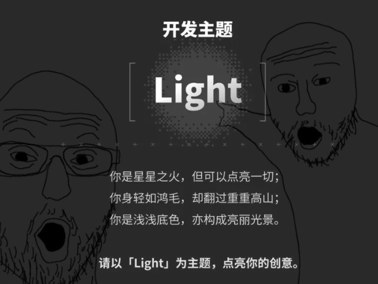
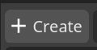

# Devlog 00

> 2024/10/08

大家好啊我是老国王CP，这里是 TapTap 聚光灯 GameJam 的开发日志。

其实完全没开始开发😓，只是跟风水一期 Devlog 这样（很自觉地设为第 0 篇，而且你注意看会发现其实是“00”因为我怕以后 Devlog 写的太多会到两位数？）。

---

- [我们](#我们)
- [主题鉴赏](#主题鉴赏)
- [可是题目和我（的游戏）又有什么关系呢](#可是题目和我（的游戏）又有什么关系呢)
- [我做了什么](#我做了什么)

---

## 我们

先给大家介绍一下我们团队吧。首先是我，老国王CP。

没了💦，以后或许会有吗……

## 主题鉴赏

是光啊，但是……宣传图很有引导性，因为原图是完全的黑底白字，而且大标题“Light”有着些微的光照效果，背后还有一团像素抖动效果的点光源，最底下黑体字还强调“点亮你的创意”（，另外这个 Jam 还叫聚光灯），所以第一反应应该都是“光”吧（是……是吗？）。

但是我发现了中间还有三行小字（←觉得自己明察秋毫很特立独行全世界只有自己与众不同实际上完全不是，所有正常人都看到了这几行字，而且大概率都会躲开“光”的解释因为关于“光”而且做的好的游戏太多了很容易相形见绌，大家讨论的时候表现出一眼“光”的反应也只是为了误导其他人做“光”的主题，以此让自己的创意脱颖而出）！描述了 Light 的三种解释，且给出了延申的方向：

- 点亮/点燃：一种行为，或许具有某种象征性意义？
- 轻：一种属性，你或许需要和“重”进行对比？
- 浅色：一种属性，或许具有某种象征性意义？

## 可是题目和我（的游戏）又有什么关系呢

会有的！（会……会吗）

首先就是玩家可以做什么。围绕主题，玩家可以做的事情其实被限制到很少了：

- 点亮/点燃（或熄灭）什么东西；
- 让什么东西变轻（或变重）；
- 让什么东西变浅（或变深）。

相应的，我们的世界也就需要存在：

- 可以被点亮/点燃（或熄灭）的东西，可以点亮/点燃（或熄灭）其他东西的东西；
- 可以被变轻（或变重）的东西，可以让其他东西变轻（或变重）的东西；
- 可以被变浅（或变深）的东西，可以让其他东西变浅（或变深）的东西。

有了这么些东西，规则也就应运而生：

- 点亮/点燃（或熄灭）特定东西；
- 让特定东西变轻（或变重）；
- 让特定东西变浅（或变深）。

最后需要配合隐形的叙述，描述一个长远的目标：

- 实现点亮/点燃所象征的某件事情；
- 通过变轻来克服某种“重”所象征的事情；
- 用浅色来克服某种“深色”所象征的事情。

有了这些具体（chou xiang）的零件后，我们（我💦）需要做的就是把它们组装起来，然后画画图写点代码拼点关卡啥的（？），前路真是一片光明（lighted）啊。

（太好了水了好多字数）

## 我做了什么

👆新建了项目

还有写了这个 Devlog 。
